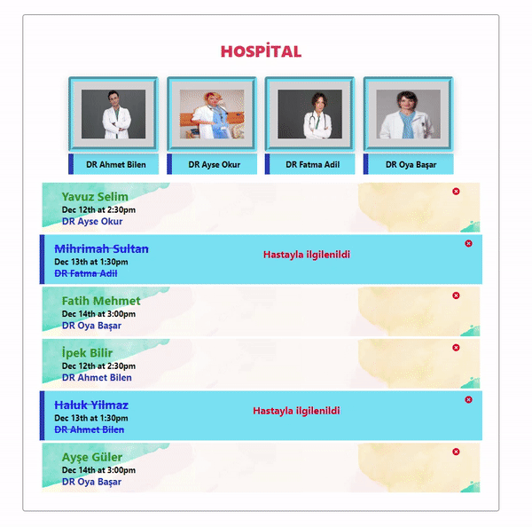

# Appointment App (RP-05)

## Description

Project aims to create a Hospital Appointment App.

## Project Skeleton

```
005 - Appointment App (folder)
|
|----readme.md         # Given to the students (Definition of the project)
SOLUTION
├── public
│     └── index.html
├── src
│    ├── components
│    │       ├── HastaEkle.jsx
│    │       │
│    │       └── HastaListe.jsx
│    │
│    ├── helper
│    │       └── Home.jsx
│    │ 
│    │ 
│    ├── App.js
│    ├── App.css
│    ├── index.js
│    └── index.css
├── package.json
└── yarn.lock
```

## Expected Outcome



## Objective

Build a Hospital Appointment App using ReactJS.

### At the end of the project, following topics are to be covered;

- HTML

- CSS

- JS

- ReactJS

## Additional Data

  - [Data.js](./helpers/data.js)
  - [images](./helpers/)


